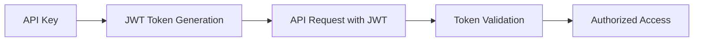

## Overview

The Complyance Modes Manager API uses **JWT (JSON Web Token)** authentication to secure all endpoints. Every API request must include a valid JWT token in the Authorization header.

<Info>
All API endpoints require authentication. There are no public endpoints available without a valid token.
</Info>

## Getting Your API Token

1. **Sign up** for a Complyance account at [dashboard.complyance.io](https://dashboard.complyance.io)
2. **Create a workspace** or join an existing one
3. **Generate an API key** from your workspace settings
4. **Use the API key** to obtain JWT tokens for API access

<Warning>
Keep your API keys secure and never expose them in client-side code or public repositories.
</Warning>

## Authentication Flow



## Making Authenticated Requests

Include your JWT token in the `Authorization` header of every API request:

<CodeGroup>

```bash cURL
curl -X GET 'https://api.complyance.io/modes-manager/integrations' \
  -H 'Authorization: Bearer YOUR_JWT_TOKEN' \
  -H 'Content-Type: application/json'
```

```javascript JavaScript
const response = await fetch('https://api.complyance.io/modes-manager/integrations', {
  method: 'GET',
  headers: {
    'Authorization': 'Bearer YOUR_JWT_TOKEN',
    'Content-Type': 'application/json'
  }
});
```

```java Java SDK
// JWT token is automatically handled by the SDK
SDKConfig config = new SDKConfig(
    "YOUR_API_KEY",
    Environment.SANDBOX,
    Arrays.asList(source)
);
GETSUnifySDK.configure(config);
```

```python Python
import requests

headers = {
    'Authorization': 'Bearer YOUR_JWT_TOKEN',
    'Content-Type': 'application/json'
}

response = requests.get(
    'https://api.complyance.io/modes-manager/integrations',
    headers=headers
)
```

</CodeGroup>

## JWT Token Structure

Your JWT token contains important claims that control access and provide context:

```json
{
  "workspaceId": "6842861b5aae3e3e6fbb3ddf",  // Used as clientId
  "userId": "user_123456789",                 // For audit trails
  "permissions": ["read", "write"],           // Access control
  "exp": 1640995200,                         // Expiration timestamp
  "iat": 1640908800                          // Issued at timestamp
}
```

### Key Claims

| Claim | Description | Usage |
|-------|-------------|--------|
| `workspaceId` | Your workspace identifier | Used as `clientId` for resource isolation |
| `userId` | Your user identifier | For audit logging and user tracking |
| `permissions` | Array of permissions | Controls API access levels |
| `exp` | Expiration time | Token validity period |

<Note>
The `workspaceId` is automatically used as your `clientId` in all API requests, ensuring you only access resources within your workspace.
</Note>

## Resource Isolation

All resources in the Modes Manager API are automatically scoped to your workspace:

- ✅ **Integrations**: Only your workspace's integrations are returned
- ✅ **Templates**: Only templates created in your workspace
- ✅ **Documents**: Only documents belonging to your workspace
- ✅ **Payloads**: Only payloads uploaded to your workspace

This ensures complete data isolation between different customers and workspaces.

## Token Expiration & Renewal

JWT tokens have a limited lifespan for security. Handle token expiration gracefully:

<Tabs>
  <Tab title="Error Response">
    ```json
    {
      "status": "error",
      "message": "Authentication failed",
      "error": {
        "code": "AUTHENTICATION_ERROR",
        "message": "JWT token has expired"
      }
    }
    ```
  </Tab>
  
  <Tab title="Handling Expiration">
    ```javascript
    async function makeAuthenticatedRequest(url, options = {}) {
      let response = await fetch(url, {
        ...options,
        headers: {
          'Authorization': `Bearer ${currentToken}`,
          'Content-Type': 'application/json',
          ...options.headers
        }
      });
      
      if (response.status === 401) {
        // Token expired, refresh and retry
        currentToken = await refreshToken();
        response = await fetch(url, {
          ...options,
          headers: {
            'Authorization': `Bearer ${currentToken}`,
            'Content-Type': 'application/json',
            ...options.headers
          }
        });
      }
      
      return response;
    }
    ```
  </Tab>
</Tabs>

## Environment-Specific Tokens

Different environments require different tokens:

<CardGroup cols={2}>
  <Card title="Sandbox Environment" icon="flask">
    **Base URL**: `https://api-sandbox.complyance.io`
    
    Use sandbox tokens for development and testing. Sandbox tokens are prefixed with `sk_test_`.
  </Card>
  <Card title="Production Environment" icon="shield">
    **Base URL**: `https://api.complyance.io`
    
    Use production tokens for live data. Production tokens are prefixed with `sk_live_`.
  </Card>
</CardGroup>

## Common Authentication Errors

<AccordionGroup>
  <Accordion title="401 Unauthorized">
    **Cause**: Missing, invalid, or expired JWT token
    
    **Solutions**:
    - Ensure the `Authorization` header is included
    - Check that your token hasn't expired
    - Verify the token format: `Bearer YOUR_JWT_TOKEN`
    - Regenerate your API key if the token is invalid
  </Accordion>

  <Accordion title="403 Forbidden">
    **Cause**: Valid token but insufficient permissions
    
    **Solutions**:
    - Check your user permissions in the dashboard
    - Ensure your workspace has access to the requested feature
    - Contact your workspace admin to adjust permissions
  </Accordion>

  <Accordion title="429 Rate Limited">
    **Cause**: Too many requests in a short time period
    
    **Solutions**:
    - Implement exponential backoff in your retry logic
    - Cache responses when possible
    - Contact support if you need higher rate limits
  </Accordion>
</AccordionGroup>

## Best Practices

<Tabs>
  <Tab title="Security">
    - **Never expose tokens** in client-side code or logs
    - **Use environment variables** to store API keys
    - **Implement token refresh logic** to handle expiration
    - **Use HTTPS only** for all API communications
    - **Rotate API keys regularly** as part of security maintenance
  </Tab>
  
  <Tab title="Error Handling">
    - **Always check response status** before processing data
    - **Implement retry logic** with exponential backoff
    - **Log authentication errors** for debugging
    - **Gracefully handle token expiration** in your application
  </Tab>
  
  <Tab title="Performance">
    - **Cache tokens** until they're close to expiration
    - **Reuse tokens** across multiple requests
    - **Implement connection pooling** for HTTP clients
    - **Monitor rate limits** and adjust request frequency
  </Tab>
</Tabs>

## Testing Authentication

Use this simple test to verify your authentication setup:

<CodeGroup>

```bash Test cURL
curl -X GET 'https://api.complyance.io/modes-manager/integrations' \
  -H 'Authorization: Bearer YOUR_JWT_TOKEN' \
  -w "Status: %{http_code}\n"
```

```javascript Test JavaScript
async function testAuth() {
  try {
    const response = await fetch('https://api.complyance.io/modes-manager/integrations', {
      headers: {
        'Authorization': 'Bearer YOUR_JWT_TOKEN',
        'Content-Type': 'application/json'
      }
    });
    
    if (response.ok) {
      console.log('✅ Authentication successful');
      const data = await response.json();
      console.log('Your integrations:', data.data.integrations.length);
    } else {
      console.log('❌ Authentication failed:', response.status);
    }
  } catch (error) {
    console.error('Network error:', error);
  }
}

testAuth();
```

</CodeGroup>

**Expected Success Response:**
```json
{
  "status": "success",
  "data": {
    "integrations": []
  }
}
```

## Need Help?

<CardGroup cols={2}>
  <Card
    title="API Key Issues"
    icon="key"
    href="mailto:support@complyance.io"
  >
    Contact support if you're having trouble with API key generation or access
  </Card>
  <Card
    title="Technical Integration"
    icon="code"
    href="https://slack.complyance.io"
  >
    Join our developer community for authentication best practices
  </Card>
</CardGroup> 